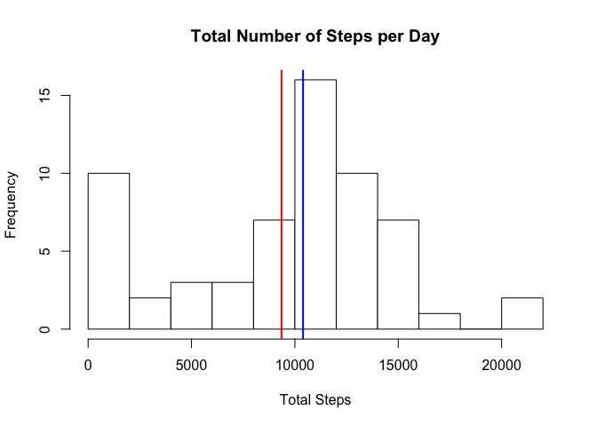
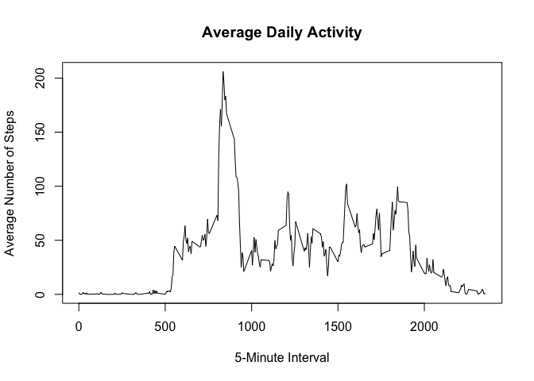
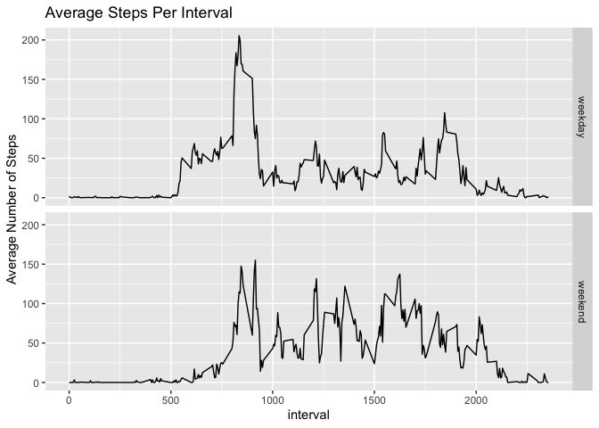

First, we need to load in required packages.


```r
library(dplyr)
library(lubridate)
library(ggplot2)
```


## Loading and preprocessing the data

Now, we read in the data.  


```r
movement_data <- read.csv("activity.csv", header = TRUE, stringsAsFactors = FALSE)
```


## What is mean total number of steps taken per day?

The first question we must answer is "What is the mean total number of steps taken per day?".

In order generate this first figure, we need to group the data by date.  Next, for each unique date, we total the steps taken.


```r
total_steps <- movement_data %>% group_by(date) %>% summarize(sum_steps = sum(steps, na.rm = T))%>% mutate(date = ymd(date)) 

head(total_steps)
```

```
## # A tibble: 6 x 2
##   date       sum_steps
##   <date>         <int>
## 1 2012-10-01         0
## 2 2012-10-02       126
## 3 2012-10-03     11352
## 4 2012-10-04     12116
## 5 2012-10-05     13294
## 6 2012-10-06     15420
```

Then, we generate a histogram.


```r
hist(total_steps$sum_steps, breaks = 15, ylab = "Frequency", xlab = "Total Steps", main = "Total Number of Steps per Day", col = "white")
abline(v = mean(total_steps$sum_steps), col = "red", lwd = 2)
abline(v = median(total_steps$sum_steps), col = "blue", lwd = 2)
```

<!-- -->

A quick look at this histogram will tell us the mean (red) total number of steps taken per day over this 2 month period.  It will also give us information on the median (blue) and the mode (highest bar).

Here, we see that the mean total number of steps falls short of 10,000 steps a day, while the median is slightly higher than 10,000 steps a day.  This can be shown computationally, as well.


```r
summary(total_steps$sum_steps)
```

```
##    Min. 1st Qu.  Median    Mean 3rd Qu.    Max. 
##       0    6778   10395    9354   12811   21194
```

This validates what our graph showed us:  the median total steps per day is 10,395 steps.  The mean is 9354 steps.


## What is the average daily activity pattern?

The next question we are tasked with answering is "What is the average daily activity pattern?".  This we must answer with a time series plot.

For this, we need to group the data by the interval variable, then take the average number of steps.


```r
interval_steps <- movement_data %>% group_by(interval) %>% summarize(mean_steps = mean(steps, na.rm = T))

plot(interval_steps, type = "l", ylab = "Average Number of Steps", xlab = "5-Minute Interval", main = "Average Daily Activity")
```

<!-- -->

Next, we can look at exactly which interval had the highest number of steps, on average.


```r
highest_interval <- which.max(interval_steps$mean_steps) %>% interval_steps[.,]

print(highest_interval)
```

```
## # A tibble: 1 x 2
##   interval mean_steps
##      <int>      <dbl>
## 1      835       206.
```

Here, we see that interval 835 has the highest average, about 206 steps.

## Imputing missing values

One thing to note about the above calculations is that the missing values are removed before analysis.  This may introduce un-intended biases. 

First, we want to see how many values are missing in our data set.


```r
table(is.na(movement_data$steps))
```

```
## 
## FALSE  TRUE 
## 15264  2304
```

Here, we see that 2,304 values are missing.  We'll replace those missing values with the median step count for each interval.  

The first step is to see exactly where the missing values are.  Are they entire days? Are there only specific intervals in days that are missing?  To do this, we look at the proportion of missing values for each day.  A value of 1 means all values are missing, and a value of 0 means no values are missing.


```r
find_values <- movement_data %>% group_by(date)

found_values <- summarize(find_values, mean(is.na(steps)))
table(found_values$`mean(is.na(steps))`)
```

```
## 
##  0  1 
## 53  8
```

We see that there are 8 days that are missing all values, 53 days that are missing no values, and no days that are missing only a few values.  Now, we pull out those rows with missing values, and plug in the median number of steps per interval.


```r
median_interval <- movement_data %>% group_by(interval) %>% summarize(median(steps, na.rm = T))

missing_rows <- movement_data[is.na(movement_data$steps == T), ]
  ##gives us a data frame with all missing values for steps, with all intervals in order.

replaced_rows <- mutate(missing_rows, steps = rep(median_interval$`median(steps, na.rm = T)`, 8))
```

Then, we'll add these rows back to a copy of the main dataset, and remove all rows with NAs still.  (Effectively, replacing all NAs with the median for each interval.)  Then, we need to reorder the rows based on date and time interval.


```r
repeat_data <- movement_data[!is.na(movement_data$steps == T), ] %>% rbind(.,replaced_rows)

arranged_data <- repeat_data %>% group_by(date) %>% arrange(., interval, .by_group = T)
head(movement_data)
```

```
##   steps       date interval
## 1    NA 2012-10-01        0
## 2    NA 2012-10-01        5
## 3    NA 2012-10-01       10
## 4    NA 2012-10-01       15
## 5    NA 2012-10-01       20
## 6    NA 2012-10-01       25
```

```r
head(arranged_data)
```

```
## # A tibble: 6 x 3
## # Groups:   date [1]
##   steps date       interval
##   <int> <chr>         <int>
## 1     0 2012-10-01        0
## 2     0 2012-10-01        5
## 3     0 2012-10-01       10
## 4     0 2012-10-01       15
## 5     0 2012-10-01       20
## 6     0 2012-10-01       25
```

Now, we tally up all the steps from each day, and graph.  Again, we'll add a mean line (red) and a median line (blue).


```r
new_total_steps <- arranged_data %>% group_by(date) %>% summarize(steps = sum(steps))

hist(new_total_steps$steps, breaks = 15, col = "white", ylab = "Frequency", xlab = "Total Steps", main = "Total Number of Steps per Day (Imputed Data)")

abline(v = mean(new_total_steps$steps), col = "red", lwd = 2)
abline(v = median(new_total_steps$steps), col = "blue", lwd = 2)
```

<!-- -->

Next, we'll calculate the mean and median, and compare it back to the mean and median of our un-imputed data set.


```r
summary(new_total_steps$steps)
```

```
##    Min. 1st Qu.  Median    Mean 3rd Qu.    Max. 
##      41    6778   10395    9504   12811   21194
```

The mean of our new data set is 9,504, and the median is 10,395.  This is slightly different than what we found before, which was a mean of 9354.  The median stays the same, at 10,395.  This makes sense, since we replaced all missing values with the median step count for its particular interval.

## Are there differences in activity patterns between weekdays and weekends?

The final question that we need to answer pertains to differences in activity between weekdays and weekends.  To do this, we need to divide the newly imputed data set into 2 different parts, one for the weekday, and one for the weekend.  For this, we'll use factors.


```r
weekday <- c("Monday")

arranged_data <- ungroup(arranged_data)

weekday_data <- mutate(arranged_data, date = ymd(date), day = weekdays(date)) 

weekday_vector <- weekday_data$day %>% gsub("Monday", "weekday",.) %>% gsub("Tuesday", "weekday",.) %>% gsub("Wednesday", "weekday",.) %>% gsub("Thursday", "weekday",.) %>% gsub("Friday", "weekday",.) %>% gsub("Saturday", "weekend",.) %>% gsub("Sunday", "weekend",.) 

weekday_data <- mutate(weekday_data, day = weekday_vector)

table(weekday_data$day)
```

```
## 
## weekday weekend 
##   12960    4608
```

So, in this data set, we have 12,960 weekday data points, and 4,608 weekend data points.  We can graph their means separately.


```r
weekday_mean <- weekday_data %>% group_by(interval, day) %>% summarize(steps = mean(steps)) 

ggplot(weekday_mean, aes(x = interval, y = steps)) + geom_line() + facet_grid(rows = vars(day)) + labs(title = "Average Steps Per Interval") + ylab("Average Number of Steps")
```

<!-- -->

From this graph, we see that this individual usually got up earlier in the day and started to wind down earlier on weekdays.  The 2 peaks during weekdays moving from left to right might correspond to leaving for work, and returning from work, respectively. 
